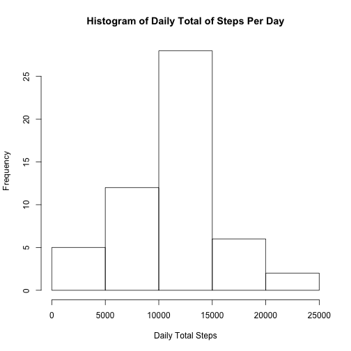
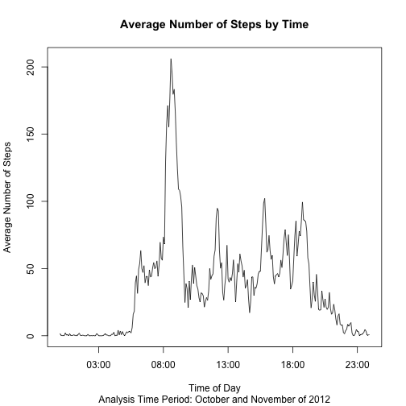
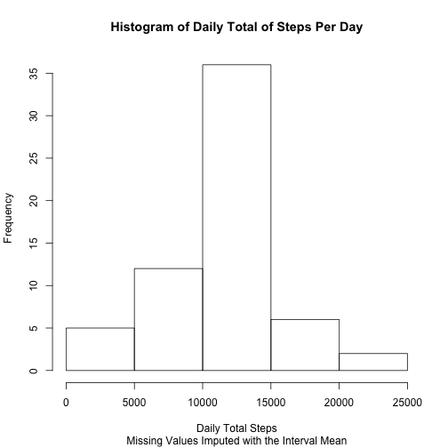
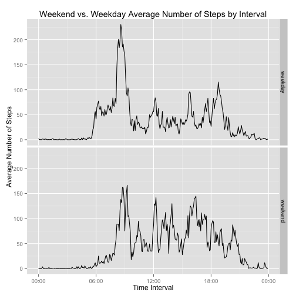

##Introduction
It is now possible to collect a large amount of data about personal movement using activity monitoring devices such as a Fitbit, Nike Fuelband, or Jawbone Up. These type of devices are part of the “quantified self” movement – a group of enthusiasts who take measurements about themselves regularly to improve their health, to find patterns in their behavior, or because they are tech geeks. But these data remain under-utilized both because the raw data are hard to obtain and there is a lack of statistical methods and software for processing and interpreting the data.

This assignment makes use of data from a personal activity monitoring device. This device collects data at 5 minute intervals through out the day. The data consists of two months of data from an anonymous individual collected during the months of October and November, 2012 and include the number of steps taken in 5 minute intervals each day.

##Data  
The data for this assignment can be downloaded from the course web site:

*  Dataset: Activity monitoring data

The variables included in this dataset are:

* steps: Number of steps taking in a 5-minute interval (missing values are coded as NA)

* date: The date on which the measurement was taken in YYYY-MM-DD format

* interval: Identifier for the 5-minute interval in which measurement was taken

The dataset is stored in a comma-separated-value (CSV) file and there are a total of 17,568 observations in this dataset.  

##Global Settings  
To ensure that all results and all the code involved in this analysis are available for the audience, we are first going to set a few global parameters.  

```r
knitr::opts_chunk$set(echo = TRUE)
```

##Loading and preprocessing the data
Show any code that is needed to

1. Load the data (i.e. read.csv()): Make sure the data is saved in your local directory.  


```r
file <- "activity.csv"
activity <- read.csv(file, na.strings = NA)
```

2. Process/transform the data (if necessary) into a format suitable for your analysis 

```r
activity <- transform (activity, 
                      date = as.Date(date))
```

##What is the mean total number of steps taken per day?

For this part of the assignment, you can ignore the missing values in the dataset.

1. Calculate the total number of steps taken per day

```r
library(dplyr) 
library(knitr)

activity_sub <- activity[complete.cases(activity[,1]),1:2]
dailytotalsteps <- activity_sub %>% group_by(date) %>% summarise(totalsteps = sum(steps))
kable(dailytotalsteps)
```


|date       | totalsteps|
|:----------|----------:|
|2012-10-02 |        126|
|2012-10-03 |      11352|
|2012-10-04 |      12116|
|2012-10-05 |      13294|
|2012-10-06 |      15420|
|2012-10-07 |      11015|
|2012-10-09 |      12811|
|2012-10-10 |       9900|
|2012-10-11 |      10304|
|2012-10-12 |      17382|
|2012-10-13 |      12426|
|2012-10-14 |      15098|
|2012-10-15 |      10139|
|2012-10-16 |      15084|
|2012-10-17 |      13452|
|2012-10-18 |      10056|
|2012-10-19 |      11829|
|2012-10-20 |      10395|
|2012-10-21 |       8821|
|2012-10-22 |      13460|
|2012-10-23 |       8918|
|2012-10-24 |       8355|
|2012-10-25 |       2492|
|2012-10-26 |       6778|
|2012-10-27 |      10119|
|2012-10-28 |      11458|
|2012-10-29 |       5018|
|2012-10-30 |       9819|
|2012-10-31 |      15414|
|2012-11-02 |      10600|
|2012-11-03 |      10571|
|2012-11-05 |      10439|
|2012-11-06 |       8334|
|2012-11-07 |      12883|
|2012-11-08 |       3219|
|2012-11-11 |      12608|
|2012-11-12 |      10765|
|2012-11-13 |       7336|
|2012-11-15 |         41|
|2012-11-16 |       5441|
|2012-11-17 |      14339|
|2012-11-18 |      15110|
|2012-11-19 |       8841|
|2012-11-20 |       4472|
|2012-11-21 |      12787|
|2012-11-22 |      20427|
|2012-11-23 |      21194|
|2012-11-24 |      14478|
|2012-11-25 |      11834|
|2012-11-26 |      11162|
|2012-11-27 |      13646|
|2012-11-28 |      10183|
|2012-11-29 |       7047|

2. If you do not understand the difference between a histogram and a barplot, research the difference between them. Make a histogram of the total number of steps taken each day


```r
hist(dailytotalsteps$totalsteps,
      xlab = "Daily Total Steps",
     main = 'Histogram of Daily Total of Steps Per Day')
```

 

3. Calculate and report the mean and median of the total number of steps taken per day

```r
dailytotalsteps_mean <- round(mean(dailytotalsteps$totalsteps), digits = 2)
dailytotalsteps_mean
```

```
[1] 10766.19
```

```r
dailytotalsteps_median <- median(dailytotalsteps$totalsteps)
dailytotalsteps_median
```

```
[1] 10765
```
The mean of the total number of steps taken per day is 1.076619 &times; 10<sup>4</sup> and the median is 10765.

##What is the average daily activity pattern?

1. Make a time series plot (i.e. type = "l") of the 5-minute interval (x-axis) and the average number of steps taken, averaged across all days (y-axis)

```r
intervalsteps_avg <- activity %>% group_by(interval) %>% summarise(avgsteps = mean(steps, na.rm = TRUE))
intervalsteps_avg_format <- transform(intervalsteps_avg, interval = as.character(sprintf("%04d", intervalsteps_avg$interval)))
intervalsteps_avg_plot <- transform(intervalsteps_avg_format,interval = strptime(intervalsteps_avg_format$interval, "%H%M"))

plot(intervalsteps_avg_plot$interval,
     intervalsteps_avg_plot$avgsteps, 
     type = "l",
     xlab = "Time of Day",
     ylab = "Average Number of Steps",
     main = "Average Number of Steps by Time",
     sub = "Analysis Time Period: October and November of 2012")
```

 

2. Which 5-minute interval, on average across all the days in the dataset, contains the maximum number of steps?

```r
maxsteps <- max(intervalsteps_avg_format$avgsteps)
maxinterval <- intervalsteps_avg_format[intervalsteps_avg_format$avgsteps == maxsteps, "interval"]
maxinterval
```

```
## [1] "0835"
```

The invteral with the most number of steps on average is 0835 with 206.1698113 number of steps.

##Imputing missing values

Note that there are a number of days/intervals where there are missing values (coded as NA). The presence of missing days may introduce bias into some calculations or summaries of the data.

1. Calculate and report the total number of missing values in the dataset (i.e. the total number of rows with NAs)

```r
activity_na <- activity[is.na(activity$steps),]
na_count <- nrow(activity_na)
na_count
```

```
## [1] 2304
```
There were 2304 missing values in the activity dataset.

2. Devise a strategy for filling in all of the missing values in the dataset. The strategy does not need to be sophisticated. For example, you could use the mean/median for that day, or the mean for that 5-minute interval, etc.
* The strategy to account for missing values is to impute the missing value with the mean for that 5 minute interval.

3. Create a new dataset that is equal to the original dataset but with the missing data filled in.

```r
activity_join <- merge(activity, intervalsteps_avg, by = "interval") 
activity_impute <- transform(activity_join, newsteps = ifelse(is.na(steps), avgsteps, steps ))
newactivity <- subset (activity_impute,select = c(newsteps,date,interval))
newactivity_ordered <- arrange(newactivity, date, interval)
kable(head(newactivity_ordered))
```


|  newsteps|date       | interval|
|---------:|:----------|--------:|
| 1.7169811|2012-10-01 |        0|
| 0.3396226|2012-10-01 |        5|
| 0.1320755|2012-10-01 |       10|
| 0.1509434|2012-10-01 |       15|
| 0.0754717|2012-10-01 |       20|
| 2.0943396|2012-10-01 |       25|

4. Make a histogram of the total number of steps taken each day and Calculate and report the mean and median total number of steps taken per day. Do these values differ from the estimates from the first part of the assignment? What is the impact of imputing missing data on the estimates of the total daily number of steps?

```r
newdailytotalsteps <- newactivity_ordered %>% group_by(date) %>% summarise(newtotalsteps = sum(newsteps))
hist(newdailytotalsteps$newtotalsteps,
      xlab = "Daily Total Steps",
     sub = "Missing Values Imputed with the Interval Mean",
     main = 'Histogram of Daily Total of Steps Per Day')
```

 

```r
newdailytotalsteps_mean <- mean(newdailytotalsteps$newtotalsteps)
newdailytotalsteps_mean
```

```
## [1] 10766.19
```

```r
newdailytotalsteps_median <- median(newdailytotalsteps$newtotalsteps)
newdailytotalsteps_median
```

```
## [1] 10766.19
```

* Looking at the above results, from the imputed values, and comparing them to the actual values, when removing the missing values, the results are pretty much the same in this dataset. So in this case, imputing the missing values vs. removing them would still yield the same overall result.  The advantage of imputing is you have more data points to analyze especially for the next part of the analysis: weekend vs. weekday.  

##Are there differences in activity patterns between weekdays and weekends?

For this part the weekdays() function may be of some help here. Use the dataset with the filled-in missing values for this part.

1. Create a new factor variable in the dataset with two levels – “weekday” and “weekend” indicating whether a given date is a weekday or weekend day


```r
newactivity_dayoftheweek <- transform(newactivity_ordered, dayoftheweek = weekdays(date))
newactivity_dayoftheweek <- transform(newactivity_dayoftheweek, daytype = as.factor(ifelse(dayoftheweek == "Saturday" | dayoftheweek == "Sunday", "weekend", "weekday")))
```

2. Make a panel plot containing a time series plot (i.e. type = "l") of the 5-minute interval (x-axis) and the average number of steps taken, averaged across all weekday days or weekend days (y-axis). See the README file in the GitHub repository to see an example of what this plot should look like using simulated data.


```r
newactivity_dayoftheweek_avg <- newactivity_dayoftheweek %>% group_by(daytype, interval) %>% summarise(avgsteps = mean(newsteps))
newactivity_dayoftheweek_format <- transform(newactivity_dayoftheweek_avg, interval = as.character(sprintf("%04d", newactivity_dayoftheweek_avg$interval)))
newactivity_dayoftheweek_plot <- transform(newactivity_dayoftheweek_format,interval = strptime(newactivity_dayoftheweek_format$interval, "%H%M"))

library(ggplot2)
library(scales) 
ggplot(data=newactivity_dayoftheweek_plot, aes(x=interval, y=avgsteps)) +  geom_line()  + 
      facet_grid(daytype ~ .) +
      labs(title="Weekend vs. Weekday Average Number of Steps by Interval") +
       ylab("Average Number of Steps") +
       xlab("Time Interval") +
      scale_x_datetime(labels=date_format("%H:%M"))
```

 
